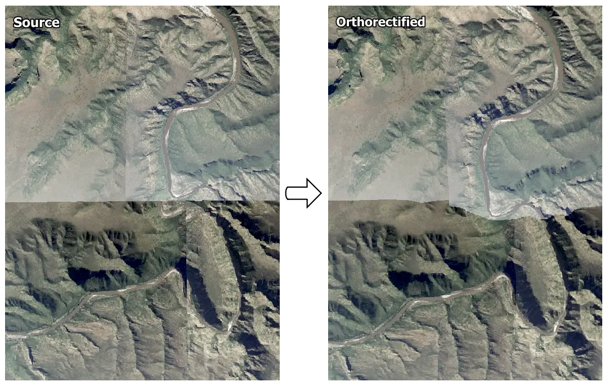

# Simple orthorectification


Fast and simple orthorectification of images with known DEM and camera model.  Designed and tested on [NGI](http://www.ngi.gov.za/index.php/what-we-do/aerial-photography-and-imagery) aerial imagery.  

## Installation
Using `conda` is the simplest way to resolve `simple-ortho` binary dependencies.  The [Minconda](https://docs.conda.io/en/latest/miniconda.html) installation includes a minimal `conda`.
1) Create a conda environment and install dependencies:
```shell
conda create -n <environment name> python=3.10 -c conda-forge 
conda activate <environment name> 
conda install -c conda-forge rasterio opencv pyyaml click tqdm
````
2) Clone the git repository and link into the conda environment:
``` shell
git clone https://github.com/leftfield-geospatial/simple-ortho.git
cd simple-ortho
pip install -e .
```

## Usage
`simple-ortho` functionality can be accessed from the `conda` command line.

### [simple-ortho](simple_ortho/command_line.py)
Orthorectify image(s). 

`simple-ortho [-h] [-od <ortho_dir>] [-rc <config_path>] [-wc <config_path>] [-v {1,2,3,4}] src_im_file [src_im_file ...] dem_file pos_ori_file`

#### Required arguments
Argument  | Description
----------|--------------
`src_im_file` | One or more path(s) and or wildcard(s) specifying the source unrectified image file(s).
`dem_file` | Path to a DEM, that covers all image(s) specified by `src_im_file`.  
`pos_ori_file` | Path to a text file specifying the camera position and orientation for  all image(s) specified by `src_im_file`.  See [camera position and orientation section](#camera-position-and-orientation) for more detail. 

#### Optional arguments
Argument | Long form | Description
---------|-----------|------------
`-h` | `--help` | Print help and exit.
`-od` `<ortho_dir>` | `--ortho-dir` `<ortho_dir>` | Write orthorectified images to `<ortho_dir>` (default: write to source directory).
`-rc` `<config_path>` | `--read_conf` `<config_path>` | Read a custom configuration from the specified `<config_path>`.  If not specified, defaults are read from [config.yaml](config.yaml).  See [configuration](#configuration-file) for more details.  
`-wc` `<config_path>` | `--write_conf` `<config_path>` | Write current configuration to  `<config_path>` and exit.
`-v` `{1,2,3,4}` | `--verbosity {1,2,3,4}` | Set the logging level (lower means more logging).  1=debug, 2=info, 3=warning, 4=error (default: 2).

#### Example
Orthorectify images matching a wildcard, with a user provided configuration, writing to a specified folder.
```shell
simple-ortho -v 2 -rc config.yaml -od ../outputs *_RGB.tif dem.tif camera_pos_ori.txt
```

### Camera position and orientation

Camera position and orientation for an image is specified in a space-separated text file.  Each row specifies the camera position and orientation for an image as follows:    
```
<Image file stem> <Easting> <Northing> <Altitude> <Omega> <Phi> <Kappa> 
```
Where `<Image file stem>` is the source file name without extension.  

For [`simple-ortho`](#simple-ortho), there should be a row with an `<Image file stem>` corresponding to each image specified by `src_im_file` argument(s).

**Note** that the coordinate reference system (CRS) of the camera positions should be a projected, and not geographic CRS.  If the source image(s) aren't projected in this CRS, it should be specified in [``config.yaml``](#configuration-file).  Camera (easting, northing, altitude) positions should be given in the units of this CRS (usually meters), and (omega, phi, kappa) orientations in degrees.   

Example file:
```
...
3323d_2015_1001_01_0001_RGBN 43333.970620 -3709166.407240 5672.686250 0.448258 -0.200394 -0.184258
3323d_2015_1001_01_0002_RGBN 44710.649080 -3709211.341900 5672.299410 -0.168341 0.013147 -0.380978
3323d_2015_1001_01_0003_RGBN 46091.888940 -3709233.718060 5676.132710 -1.493311 -0.004520 -0.158283
...
```

### Camera type

`simple-ortho` implements common lens distortion models.  The *camera* section of the [configuration file](#configuration-file) contains the camera type and distortion parameter specification.  `simple-ortho` distortion models are compatible with [OpenDroneMap (ODM)](https://opendronemap.org/) / [OpenSfM](https://github.com/mapillary/OpenSfM) and [OpenCV](https://opencv.org/) distortion parameter estimates.  ODM writes parameter values to the *&lt;ODM dataset path&gt;/cameras.json* file, and OpenSfM to the *&lt;OpenSfM dataset path&gt;/reconstruction.json* file.  Any parameters not specified will default to zero.  The following camera types and distortion parameters are supported.

| Type      | Parameters                                                                          | Description
|-----------|-------------------------------------------------------------------------------------|------------
| `pinhole` |                                                                                     | Pinhole camera model with no distortion.
| `brown`   | `k1`, `k2`, `p1`, `p2`, `k3`                                                        | Brown-Conrady lens distortion compatible with ODM / OpenSfM *brown* parameters, and the 4- and 5- element version of the [generic OpenCV distortion model](https://docs.opencv.org/4.x/d9/d0c/group__calib3d.html). 
| `fisheye` | `k1`, `k2`, `k3`, `k4`                                                              | Fisheye lens distortion compatible ODM / OpenSfM, and [OpenCV](https://docs.opencv.org/4.x/db/d58/group__calib3d__fisheye.html) *fisheye* parameters.  The ODM / OpenSfM model is a special case of the OpenCV version with `k3, k4 = 0`.  
| `opencv`  | `k1`, `k2`, `p1`, `p2`, `k3`, `k4`, `k5`, `k6`, `s1`, `s2`, `s3`, `s4`, `tx`, `τy`  | The full [generic OpenCV distortion model](https://docs.opencv.org/4.x/d9/d0c/group__calib3d.html).  Partial or special cases of the model can be specified by omitting some or all of the parameters; e.g. if no distortion coefficients are specified, this model corresponds to `pinhole`, or if the first 5 distortion coefficients are specified, this model corresponds to `brown`.

### Configuration file

Configuration settings, not passed explicitly on the command line, are read from [config.yaml](config.yaml).  Users can make their own configuration files and pass them to [`simple-ortho`](#simple-ortho) with the `-rc <config_path>` argument.   The configuration file is separated into *camera* and *ortho* sections, with settings for the camera model and orthorectification respectively.  Parameters in each section are described below and commented in [config.yaml](config.yaml).  

| Section  | Parameter       | Description
|----------|-----------------|------------
| `camera` | `name`          | Camera ID.
|          | `type`          | [Camera type](#camera-type) (`pinhole`, `brown`, `fisheye`, `opencv`).
|          | `focal_len`     | Focal length in same units/scale as `sensor_size`.  Can be a single value or `[x, y]` pair.
|          | `sensor_size`   | Optional sensor `[width, height]` in same units/scale as `focal_len`.  If omitted, pixels are assumed square, and`focal_len` should be normalised and unitless:  i.e. `focal_len` = (focal length) / (sensor width).
|          | `im_size`       | Image `[width, height]` dimensions in pixels.
|          | `cx`, `cy`      | Principal point offsets in [normalised image coordinates](https://opensfm.readthedocs.io/en/latest/geometry.html#normalized-image-coordinates). Values default to zero if not specified.    
|          | `k1`, `k2`, ... | Optional distortion coefficients for the `brown`, `fisheye` and `opencv`  [camera types](#camera-type).  Values default to zero if not specified.
| `ortho`  | `crs`           | CRS of the camera positions and ortho image as an EPSG, proj4 or WKT string.  Should be a projected, and not geographic CRS.  Can be omitted if the source image(s) are projected in this CRS.
|          | `dem_interp`    | Interpolation type for resampling the DEM (`average`, `bilinear`, `cubic`, `lanczos`, `nearest`).  `cubic` or `lanczos` are recommended where the DEM resolution is coarser than the ortho image.
|          | `dem_band`      | Index of band in DEM image to use (1-based).
|          | `interp`        | Interpolation type for remapping source to ortho image (`average`, `bilinear`, `cubic`, `lanczos`, `nearest`).  
|          | `per_band`      | Remap source to ortho image band-by-band (`True`), or all at once (`False`).  `per_band=False` is faster, but requires more memory.  (`True`, `False`).
|          | `build_ovw`     | Build internal overviews (`True`, `False`).
|          | `overwrite`     | Overwrite ortho image(s) if they exist (`True`, `False`).
|          | `write_mask`    | Write an internal mask band - helps remove jpeg noise in nodata area (`True`, `False`).  If omitted, the mask will be written when jpeg compression is used.
|          | `full_remap`    | Remap source to ortho with full camera model (`True`), or remap undistorted source to ortho with pinhole model (`False`). 
|          | `dtype`         | Data type of ortho image (`uint8`, `uint16`, `float32` or `float64`).  If omitted, the source image `dtype` is used (recommended).
|          | `resolution`    | Ortho pixel size `[x, y]` in units of the `crs` (usually meters).
|          | `compress`      | Ortho image compression type (`deflate`, `jpeg`, or `auto`).  `auto` uses jpeg compression for uint8 `dtype`, deflate otherwise.

## Example Application
Four [NGI](http://www.ngi.gov.za/index.php/what-we-do/aerial-photography-and-imagery) images before and after orthorectification with simple-ortho.  No radiometric (colour) adjustments have been applied, this can be addressed with [`homonim`](https://github.com/leftfield-geospatial/homonim).  



Coarse resolution versions of these images, together with supporting data, are included in the [tests/data/ngi](tests/data/ngi) directory.  You can orthorectify this data with the following command line (from the simple-ortho directory):
```shell
simple-ortho -v 2 -rc ./tests/data/ngi/config.yaml -od ./tests/data/outputs ./tests/data/ngi/*RGB.tif ./tests/data/ngi/dem.tif ./tests/data/ngi/camera_pos_ori.txt
```

## Known limitations

The `conda-forge` `rasterio` package does not currently support 12bit jpeg compression (the format sometimes used by NGI).  Any tiff compressed in this way would need to be converted using a tool capable of reading these images.  

## License
This project is licensed under the terms of the [Apache-2.0 License](LICENSE).

## Acknowledgements
Special thanks to [National Geo-spatial Information (NGI)](http://www.ngi.gov.za/index.php/what-we-do/aerial-photography-and-imagery) and the [Centre for Geographical Analysis (CGA)](http://www0.sun.ac.za/cga/) for providing imagery, DEM and aero-triangulation data.
