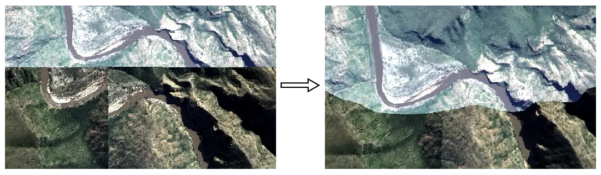
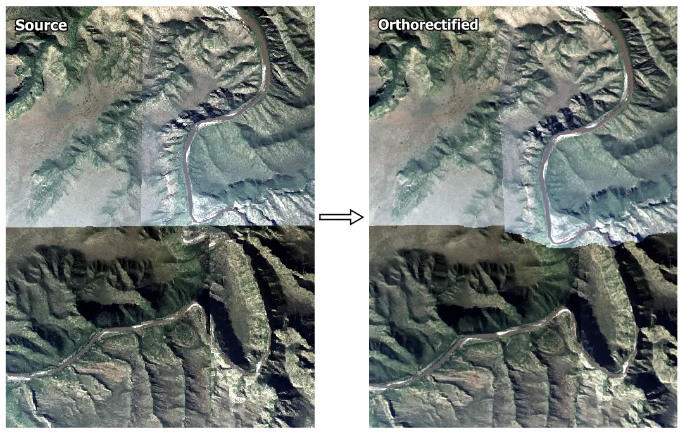

# Simple orthorectification



Fast and simple orthorectification of images with known DEM and camera model.  Designed and tested on [NGI](http://www.ngi.gov.za/index.php/what-we-do/aerial-photography-and-imagery) aerial imagery.  

## Installation
Using `conda` is the simplest way to resolve `simple-ortho` binary dependencies.  The [Minconda](https://docs.conda.io/en/latest/miniconda.html) installation includes a minimal `conda`.
1) Create a conda environment and install dependencies:
```shell
conda create -n <environment name> python=3.8 -c conda-forge 
conda activate <environment name> 
conda install -c conda-forge rasterio opencv pandas pyyaml shapely
````
2) Clone the git repository and link into the conda environment:
``` shell
git clone https://github.com/leftfield-geospatial/simple-ortho.git
pip install -e simple-ortho
```

### Requirements  
The following dependencies are installed in the process above.
  
  - python >= 3.8
  - rasterio >= 1.2
  - opencv >= 4.5
  - pandas >= 1.2
  - pyyaml >= 5.4
  - shapely >= 1.7

## Usage
`simple-ortho` functionality can be accessed from the `conda` command line.

### [simple-ortho](simple_ortho/command_line.py)
Orthorectify image(s). 

`simple-ortho [-h] [-od <ortho_dir>] [-rc <config_path>] [-wc <config_path>] [-v {1,2,3,4}] src_im_file [src_im_file ...] dem_file pos_ori_file`

#### Required arguments
Argument  | Description
----------|--------------
`src_im_file` | One or more path(s) and or wildcard(s) specifying the source unrectified image file(s).
`dem_file` | Path to a DEM, that covers all image(s) specified by `src_im_file`.  
`pos_ori_file` | Path to a text file specifying the camera position and orientation for  all image(s) specified by `src_im_file`.  See [camera position and orientation section](#camera-position-and-orientation) for more detail. 

#### Optional arguments
Argument | Long form | Description
---------|-----------|------------
`-h` | `--help` | Print help and exit.
`-od` `<ortho_dir>` | `--ortho-dir` `<ortho_dir>` | Write orthorectified images to `<ortho_dir>` (default: write to source directory).
`-rc` `<config_path>` | `--read_conf` `<config_path>` | Read a custom configuration from the specified `<config_path>`.  If not specified, sensible defaults are read from [config.yaml](config.yaml).  See [configuration](#configuration) for more details.  
`-wc` `<config_path>` | `--write_conf` `<config_path>` | Write current configuration to  `<config_path>` and exit.
`-v` `{1,2,3,4}` | `--verbosity {1,2,3,4}` | Set the logging level (lower means more logging).  1=debug, 2=info, 3=warning, 4=error (default: 2).

### Examples
Orthorectify a single image with a user provided configuration, writing to a specified folder.
```shell
simple-ortho -v 2 -rc ./data/inputs/test_example/config.yaml -od ./data/outputs/test_example/ ./data/inputs/test_example/3324c_2015_1004_06_0253_RGB.tif ./data/inputs/test_example/dem.tif ./data/inputs/test_example/camera_pos_ori.txt
```
Orthorectify images matching a wildcard, with a user provided configuration, writing to a specified folder.
```shell
simple-ortho -v 2 -rc ./data/inputs/test_example/config.yaml -od ./data/outputs/test_example ./data/inputs/test_example/*_RGB.tif ./data/inputs/test_example/dem.tif ./data/inputs/test_example/camera_pos_ori.txt
```

### [batch_recompress](scripts/batch_recompress.bat)
An auxiliary (windows) batchfile script to recompress images matching a wildcard, using DEFLATE compression.  

If necessary, this script can be used to address the incompatibility of `conda`'s `gdal` package with 12bit jpeg compressed tiffs sometimes used by [NGI](http://www.ngi.gov.za/index.php/what-we-do/aerial-photography-and-imagery).   [OSGeo4W](https://trac.osgeo.org/osgeo4w/) with `gdal` is required.  Recompressed tiffs can then be processed with [`simple-ortho`](#simple-ortho).  

Run ```batch_recompress``` without arguments to get help.

`batch_recompress src_im_wildcard`
#### Required arguments
Argument  | Description
----------|--------------
`src_im_wildcard` | Process images matching this wildcard pattern (e.g. './\*_RGB.TIF').  Recompressed files are written to new files named '\*_CMP.tif'.
### Example
```shell
batch_recompress .\data\inputs\test_example\*_RGB.tif
```

## File formats
### Camera position and orientation
Camera position and orientation for an image is specified in a space-separated text file.  The file format is the same as that used by PCI Geomatica's OrthoEngine i.e. each row specifies the camera position and orientation for an image as follows:    
```
<Image file stem> <Easting (m)> <Northing (m)> <Altitude (m)> <Omega (deg)> <Phi (deg)> <Kappa (deg)> 
```
Where `<Image file stem>` is the source file name excluding extension.  

For [`simple-ortho`](#simple-ortho), there should be a row with an `<Image file stem>` corresponding to each image specified by `src_im_file` argument(s).

**Note** that the camera (Easting, Northing) position must be specified in the same co-ordinate reference system (CRS) as that of the source image.

Example file:
```
...
3323d_2015_1001_01_0001_RGBN 43333.970620 -3709166.407240 5672.686250 0.448258 -0.200394 -0.184258
3323d_2015_1001_01_0002_RGBN 44710.649080 -3709211.341900 5672.299410 -0.168341 0.013147 -0.380978
3323d_2015_1001_01_0003_RGBN 46091.888940 -3709233.718060 5676.132710 -1.493311 -0.004520 -0.158283
...
```
### Configuration

Default configuration settings, not passed explicitly on the command line, are read from [config.yaml](config.yaml).  Optionally, users can make their own configuration files and pass them to [`simple-ortho`](#simple-ortho) with the `-rc <config_path>` argument.   The configuration file is separated into 'camera' and 'ortho' sections, with settings for the camera model and orthorectification respectively.  Parameters in each section are described below and commented in [config.yaml](config.yaml).  

| Section | Parameter  | Description
|--------|------------|------------
| `camera` | `name` | Descriptive name
| | `focal_len` | Focal length in mm
| | `sensor_size` | Sensor/CCD `[width, height]` dimensions in mm.
| | `im_size` | Image `[width, height]` dimensions in pixels.
| `ortho` | `dem_interp` | Interpolation method for resampling the DEM (`average`, `bilinear`, `cubic`, `cubic_spline`, `gauss`, `lanczos`).  `cubic_spline` is recommended where the DEM resolution is coarser than the ortho-image resolution.
| | `dem_band` | Index of band in DEM raster to use (1-based).
| | `interp` | Interpolation method to use for warping source to orthorectified image (`nearest`, `average`, `bilinear`, `cubic`, `lanczos`).  `nearest` is recommended where the ortho-image resolution is close to the source image resolution.
| | `per_band` | Remap the source to the ortho-image band-by-band (`True`), or all at once (`False`).  `per_band=False` is generally faster, but requires more memory.   (`True`, `False`).
| | `build_ovw` | Build internal overviews (`True`, `False`).
| | `overwrite` | Overwrite ortho image(s) if they exist (`True`, `False`).
| |  `write_mask` | Write an internal mask band - can help remove jpeg noise in nodata area  (`True`, `False`).  (`False` recommended.)
| | `driver` | File format of ortho image - see www.gdal.org/formats_list.html for options.  If no format is specified, the format of the source image will be used. `GTiff` recommended.
| | `dtype` | Data type of ortho image (`uint8`, `uint16`, `float32` etc).  If no `dtype` is specified the same type as the source image will be used (recommended).
| | `resolution` | Output pixel size `[x, y]` in m.
| | `tile_size` | Tile/block `[width, height]` size in pixels (`[512, 512]` recommended).
| | `compress` | Ortho image compression type (`deflate`, `jpeg`, `jpeg2000`, `lzw`, `zstd`, `none`).  `deflate` recommended in most instances. (None = same as source image).
| | `interleave` | Interleave ortho-image data by `pixel` or `band` (`pixel`, `band`).  `interleave=band` is recommended for `compress=deflate`. (None = same as source image).
| | `photometric` | Photometric interpretation, see https://gdal.org/drivers/raster/gtiff.html for options (None = same as source image).
| | `nodata` | NODATA numeric value for the ortho-image (0 recommended).

## Example Application
Four [NGI](http://www.ngi.gov.za/index.php/what-we-do/aerial-photography-and-imagery) images before and after orthorectification with simple-ortho.  No radiometric (colour) adjustments have been applied, this will be addressed in a separate tool. 



Coarse resolution versions of these images, together with supporting data, are included in the [data/inputs/test_example](data/inputs/test_example) directory.  You can orthorectify this data with the following command line (from the simple-ortho directory):
```shell
simple-ortho -v 2 -rc ./data/inputs/test_example/config.yaml -od ./data/outputs/test_example ./data/inputs/test_example/*RGB.tif ./data/inputs/test_example/dem.tif ./data/inputs/test_example/camera_pos_ori.txt
```

## Known limitations
- The `conda` `gdal` package does not support 12bit jpeg compression (the format sometimes used by NGI).  Any tiff compressed in this way would need to be converted using a tool capable of reading these tiffs.  Ensure that the image geo-location is not changed by this conversion, as that would invalidate camera position information. `gdal_translate` supplied by [OSGeo4W](https://trac.osgeo.org/osgeo4w/) is one option for conversion.  The [`batch_recompress`](#batch_recompress) script uses `gdal_translate` to perform this conversion.  Converted files can then be processed with [`simple-ortho`](#simple-ortho).

## License
This project is licensed under the terms of the [Apache-2.0 License](LICENSE).

## Acknowledgements
Special thanks to [National Geo-spatial Information (NGI)](http://www.ngi.gov.za/index.php/what-we-do/aerial-photography-and-imagery) and the [Centre for Geographical Analysis (CGA)](http://www0.sun.ac.za/cga/) for providing imagery, DEM and aero-triangulation data.
