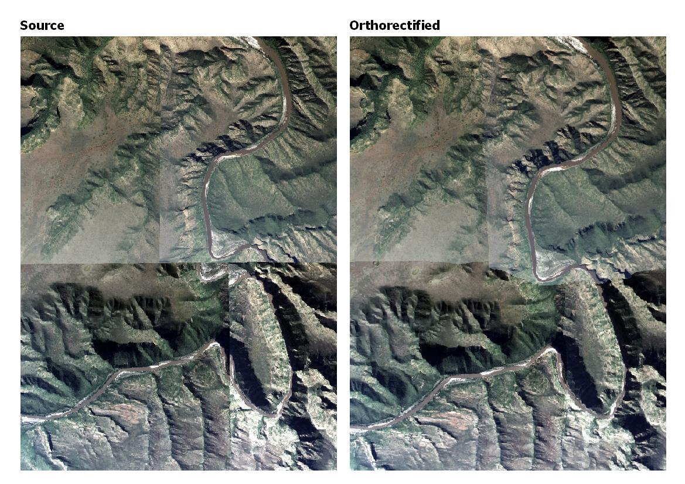

# Simple orthorectification
Fast and simple orthorectification of images with known DEM and camera model.  Designed and tested on [NGI](http://www.ngi.gov.za/index.php/what-we-do/aerial-photography-and-imagery) aerial imagery.  

## Installation
Using `conda` to manage packages and dependencies is recommended.  The [Minconda](https://docs.conda.io/en/latest/miniconda.html) installation includes a minimal `conda`.
1) Create a conda environment and install dependencies:
```shell
conda create -n <environment name> python=3.8 -c conda-forge 
conda activate <environment name> 
conda install -c conda-forge rasterio gdal=3.1 opencv pandas pyyaml
````
2) Clone the git repository and link into the conda environment:
``` shell
git clone https://github.com/dugalh/simple_ortho.git
pip install -e simple_ortho
```

### Requirements  
The following dependencies are installed in the process above.  The `rasterio` package has binary dependencies that are not directly available through `pip`, hence the recommendation for using `conda`.  `gdal` is forced to 3.1 currently as later versions are buggy.     
  
  - python >= 3.8
  - gdal = 3.1
  - rasterio >= 1.2
  - opencv >= 4.5
  - pandas >= 1.2
  - pyyaml >= 5.4

## Scripts
simple_ortho functionality is accessed by calling scripts, located in the [scripts](scripts) directory.  They can be run from a `conda` prompt in the simple_ortho folder.

### [ortho_im](scripts/ortho_im.py)
Orthorectifies an image. 

**Usage:** `python scripts/ortho_im.py [-h] [-o <ortho_path>] [-rc <config_path>] [-wc <config_path>] [-v {1,2,3,4}] src_im_file dem_file pos_ori_file`

#### Required arguments
Argument  | Description
----------|--------------
`src_im_file` | Path to the source unrectified image file.
`dem_file` | Path to a DEM, that covers `src_im_file`.  
`pos_ori_file` | Path to a text file specifying the camera position and orientation file for `src_im_file`.  See [camera position and orientation section](#camera-position-and-orientation) for more detail. 

#### Optional arguments
Argument | Long form | Description
---------|-----------|------------
`-h` | `--help` | Print help and exit.
`-o` `<ortho_path>` | `--ortho` `<ortho_path>` | Write the orthorectified file to the specified `<ortho_path>` filename.  (Default: name the orthorectified image '`<src_im_file>`_ORTHO.tif').
`-rc` `<config_path>` | `--readconf` `<config_path>` | Read a custom configuration from the specified `<config_path>`.  (The default is to read configuration from [config.yaml](config.yaml)).  See [configuration](#configuration) for more details.  
`-wc` `<config_path>` | `--writeconf` `<config_path>` | Write current configuration to  `<config_path>` and exit.
`-v` `{1,2,3,4}` | `--verbosity {1,2,3,4}` | Set the logging level (lower means more logging).  1=debug, 2=info, 3=warning, 4=error (default: 2).

### Example
```
python scripts/ortho_im.py -v 2 -rc ./config.yaml -o ortho_1.tif source_1.tif dem.tif cam_pos_ori.txt
``````

### [batch_ortho_im](scripts/batch_ortho_im.py)
Orthorectifies a group of images matching a wildcard.  

**Usage:** `python  scripts/batch_ortho_im.py [-h] [-rc <config_path>] [-v {1,2,3,4}] src_im_wildcard dem_file pos_ori_file`

#### Required arguments
Argument  | Description
----------|--------------
`src_im_wildcard` | Source image wildcard pattern or directory (e.g. '.' or './*_CMP.TIF')
`dem_file` | Path to a DEM, that covers the images matching `src_im_wildcard`.  
`pos_ori_file` | Path to a text file specifying the camera position and orientation for the images matching `src_im_wildcard`.  See [camera position and orientation section](#camera-position-and-orientation) for more detail. 

#### Optional arguments
Argument | Long form | Description
---------|-----------|------------
`-h` | `--help` | Print help and exit
`-rc` `<config_path>` | `--readconf` `<config_path>` | Read a custom configuration from the specified `<config_path>`.  (The default is to read configuration from [config.yaml](config.yaml)).  See [configuration](#configuration) for more details.  
`-v` `{1,2,3,4}` | `--verbosity {1,2,3,4}` | Set the logging level (lower means more logging).  1=debug, 2=info, 3=warning, 4=error (default: 2).

### Example
```
python scripts/batch_ortho_im.py -v 2 -rc ./config.yaml source_*.tif dem.tif cam_pos_ori.txt
``````


### [batch_recompress](scripts/batch_recompress.bat)
An auxiliary batchfile script to recompress images matching a wildcard, using DEFLATE compression.  

If necessary, this script can be used to address the incompatibility of `conda`'s `gdal` package with 12bit jpeg compressed tiffs sometimes used by [NGI](http://www.ngi.gov.za/index.php/what-we-do/aerial-photography-and-imagery).   [OSGeo4W](https://trac.osgeo.org/osgeo4w/) with `gdal` is required.  DEFLATE compressed tiffs can then be processed with [`ortho_im`](#ortho_im) or [`batch_ortho_im`](#batch_ortho_im).  

Run ```scripts\batch_recompress.bat``` without arguments to get help.

**Usage:** `scripts\batch_recompress.bat src_im_wildcard`
#### Required arguments
Argument  | Description
----------|--------------
`src_im_wildcard` | Process images matching this wildcard pattern (e.g. './*_RGB.TIF').  Recompressed files are written to new files named '\*_CMP.tif'.


## File formats
### Camera position and orientation
Camera position and orientation for an image is specified in a space-separated text file.  The file format is the same as that used by PCI Geomatica's OrthoEngine i.e. each row specifies the camera position and orientation for an image as follows:    
```
<Image file stem> <Easting (m)> <Northing (m)> <Altitude (m)> <Omega (deg)> <Phi (deg)> <Kappa (deg)> 
```
Where `<Image file stem>` is the source file name excluding extension.  

For [`ortho_im`](#ortho_im), there should be a row with an `<Image file stem>` corresponding to the `src_im_file` argument.  Similarly, for [`batch_ortho_im`](#batch_ortho_im), there should be rows corresponding to the images matching the `src_im_wildcard` argument.

**Note** that the camera (Easting, Northing) position must be specified in the same co-ordinate reference system (CRS) as that of the source image.

Example file:
```
...
3323d_2015_1001_01_0001_RGBN 43333.970620 -3709166.407240 5672.686250 0.448258 -0.200394 -0.184258
3323d_2015_1001_01_0002_RGBN 44710.649080 -3709211.341900 5672.299410 -0.168341 0.013147 -0.380978
3323d_2015_1001_01_0003_RGBN 46091.888940 -3709233.718060 5676.132710 -1.493311 -0.004520 -0.158283
...
```
### Configuration

Detailed configuration information, not passed explicitly on the command line, is specified in [config.yaml](config.yaml).  Optionally, users can make their own configuration files and pass them to [`ortho_im`](#ortho_im) and [`batch_ortho_im`](#batch_ortho_im) with the `-rc <config_path>` optional argument.   The configuration file is separated into 'camera' and 'ortho' sections, with settings for the camera model and orthorectification respectively.  Parameters in each section are described below.  You can also take a look at the comments in [config.yaml](config.yaml).  Note that YAML, like python, is indentation sensitive.

| Section | Parameter  | Description
|--------|------------|------------
| `camera` | `name` | Descriptive name
| | `focal_len` | Focal length in mm
| | `sensor_size` | Sensor/CCD `[width, height]` dimensions in mm.
| | `im_size` | Image `[width, height]` dimensions in pixels.
| `ortho` | `dem_interp` | Interpolation method for resampling the DEM (`average`, `bilinear`, `cubic`, `cubic_spline`, `gauss`, `lanczos`).  `cubic_spline` is recommended where the DEM resolution is coarser than the ortho-image resolution.
| | `dem_band` | Index of band in DEM raster to use (1-based).
| | `interp` | Interpolation method to use for warping source to orthorectified image (`nearest`, `average`, `bilinear`, `cubic`, `lanczos`).  `nearest` is recommended where the ortho-image resolution is close to the source image resolution.
| | `resolution` | Output pixel size `[x, y]` in m.
| | `compression` | Ortho image compression type (`deflate`, `jpeg`, `jpeg2000`, `lzw`, `zstd`, `none`).  `deflate` recommended in most instances.
| | `tile_size` | Tile/block `[width, height]` size in pixels (`[512, 512]` recommended).
| | `interleave` | Interleave ortho-image data by `pixel` or `band` (`pixel`, `band`).  `interleave=band` is recommended for `compression=deflate`.
| | `photometric` | Photometric interpretation, see https://gdal.org/drivers/raster/gtiff.html for options (None = same format as source image)
| | `nodata` | NODATA numeric value for the ortho-image (0 recommended).
| | `per_band` | Remap the source to the ortho-image band-by-band (`True`), or all at once (`False`).  `per_band=False` is generally faster, but requires more memory.   (`True`, `False`).
| | `format` | File format of ortho image - see www.gdal.org/formats_list.html for options.  If no format is specified, the format of the source image will be used. `GTiff` recommended.
| | `dtype` | Data type of ortho image (`uint8`, `uint16`, `float32` etc).  If no `dtype` is specified the same type as the source image will be used (recommended).
| | `build_ovw` | Build internal overviews (`True`, `False`).
| | `overwrite` | Overwrite ortho image(s) if it/they exist (`True`, `False`).
| |  `write_mask` | Write an internal mask band - can help remove jpeg noise in nodata area  (`True`, `False`).  (`False` recommended.)

## Example
Four [NGI](http://www.ngi.gov.za/index.php/what-we-do/aerial-photography-and-imagery) images before and after orthorectification with simple_ortho.  No radiometric (colour) adjustments have been applied, this will be addressed in a separate tool. 



## Known limitations

- The `conda` `gdal` package does not support 12bit jpeg compression (the format sometimes used by NGI).  Any tiff compressed in this way would need to be converted using a tool capable of reading these tiffs.  You should ensure that the image geo-referenced position is not changed by this conversion, as that would invalidate existing camera position information. `gdal_translate` supplied by [OSGeo4W](https://trac.osgeo.org/osgeo4w/) is one option for conversion.  The [`batch_recompress`](#batch_recompress) script uses `gdal_translate` to perform this conversion.  Converted files can then be processed with [ortho_im](#ortho_im) and [batch_ortho_im](#batch_ortho_im).

## License
This project is licensed under the terms of the [Apache-2.0 License](LICENSE).

## Author
**Dugal Harris** - [dugalh@gmail.com](mailto:dugalh@gmail.com)

## Acknowledgements
Special thanks to [National Geo-spatial Information (NGI)](http://www.ngi.gov.za/index.php/what-we-do/aerial-photography-and-imagery) and the [Centre for Geographical Analysis (CGA)](http://www0.sun.ac.za/cga/) for providing imagery, DEM and aero-triangulation data.
