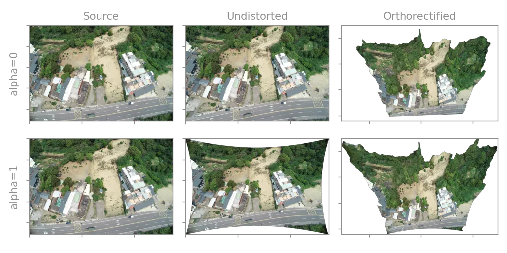

Camera configuration
=======================

Required camera model parameters are read from file.  Additional command line options allow configuration of the model behaviour.

Frame cameras
-------------

The ``--full-remap`` option configures a :ref:`frame camera <background/camera_models:frame cameras>` to remap the source to ortho image in one step.  This uses the full model including distortion, and is the default behaviour.  With ``--no-full-remap``, the source is first remapped to an undistorted image, then remapped to the ortho image using a pinhole model excluding distortion.  ``--no-full-remap`` is faster, but can use more memory and reduce ortho quality, as it remaps and interpolates twice.

The ``--alpha`` option can be supplied with ``--no-full-remap`` to specify the scaling of the undistorted image.  An ``--alpha`` value of 0 scales the undistorted image so that all its pixels are valid.  An ``--alpha`` value of 1 (the default) scales the undistorted image so that it includes all source pixels.  The plot below illustrates this for ``--alpha`` values of 0 and 1:

To show the use of these options, we orthorectify the OpenDroneMap dataset using the ``--no-full-remap`` option with an ``--alpha`` value of 0:

.. code-block:: bash

    oty odm --dataset-dir odm --no-full-remap --alpha 0 --overwrite

.. note::

    The ``--full-remap`` / ``--no-full-remap`` and ``--alpha`` options have no effect for pinhole camera models.
