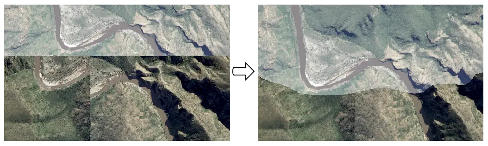

.. orthority documentation master file, created by
   sphinx-quickstart on Mon Oct 16 13:53:06 2023.
   You can adapt this file completely to your liking, but it should at least
   contain the root `toctree` directive.

orthority
=========

Contents
--------

.. toctree::
   :maxdepth: 2
   :caption: Contents:

Indices and tables
==================

* :ref:`genindex`
* :ref:`modindex`
* :ref:`search`
